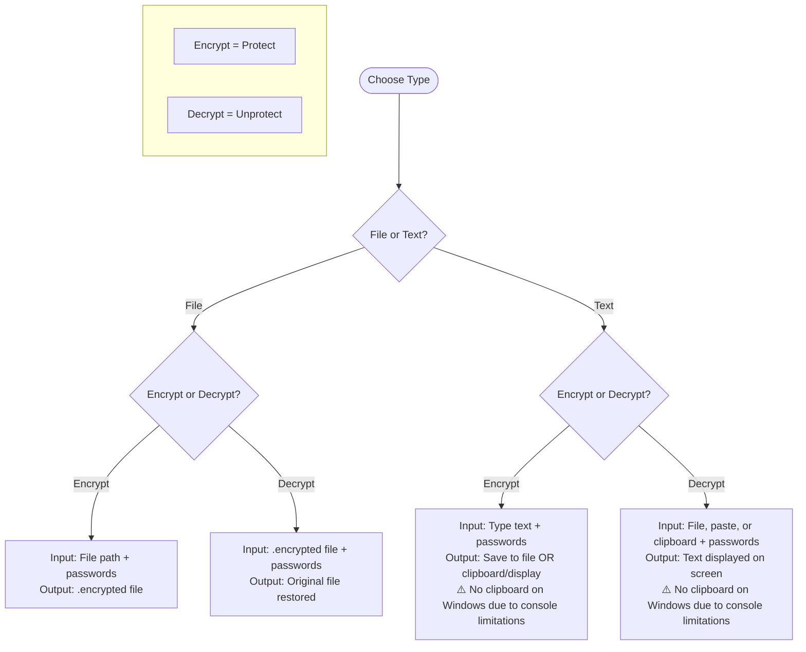

# encryptor

encryptor is a command-line cryptographic tool for daily usage that combines classical cryptographic algorithms with post-quantum algorithms for quantum-proof security. There is no data collection or internet access, nothing is sent anywhere. It uses:

- Edwards-curve Digital Signature Algorithm using Curve448 and Dilithium5 to sign (at the same time)
- AES-256-GCM and Kyber1024 to encrypt (at the same time)
- Argon2id with memory-hard parameters for key derivation

## Installation

**Quick Download:**
- [Windows](https://github.com/erendemirel/encryptor/releases/latest/download/encryptor-windows.zip) - Download, extract, double-click `run-encryptor`
- [macOS](https://github.com/erendemirel/encryptor/releases/latest/download/encryptor-macos.tar.gz) - Download, extract, run `./run-encryptor`
- [Linux](https://github.com/erendemirel/encryptor/releases/latest/download/encryptor-linux.tar.gz) - Download, extract, run `./run-encryptor`

> [!IMPORTANT]  
> Your antivirus might block the program. You need to allow it.

## How to Use

### First Time Setup

The first time you run encryptor, it will ask you to set a **master password**. You'll need this password every time you use any feature. 

> [!WARNING]  
> **Remember this password!** - without it you cannot perform any operation

### Usage - How to Encrypt and Decrypt Data

Follow the chart below to understand the inputs and outputs for each operation shown in the application menu:

> [!TIP]
> All operations **require two passwords**:

- Master password (as described above, created once, always the same, affects all encrypted data)
- Protection password (created for each encryption, can be different each time, specific to that encryption only)

## What Must Be Kept Secret and What Can Be Shared

### What must be kept secret (never share these)

1. **Master Password** - You create this during first-time setup (stored only in your memory)
2. **Protection Passwords** - Individual passwords you create for each encryption (stored only in your memory)
3. **`encryptor.kyber`** - Created automatically during first-time setup (located in the same folder as the encryptor program)
4. **`encryptor.key`** - Created automatically during first-time setup (located in the same folder as the encryptor program)

### What can be shared

1. **`encryptor.pub`** - Created automatically during first-time setup (located in the same folder as the encryptor program)
2. **`.encrypted` files** - Created when you encrypt/protect files (created in the same location as your original files)
3. **Encrypted text output** - Created when you encrypt/protect text (displayed on screen or saved to .txt files like `protected_1234567890.txt` containing encoded encrypted text)

## Guide & Troubleshooting 

See [Q&A](https://github.com/erendemirel/encryptor/blob/main/docs/TROUBLESHOOTING.md)

## How It Works

See [documentation](https://github.com/erendemirel/encryptor/blob/main/docs/DOCUMENTATION.md)

## Security Notice

This software has not been independently security audited. Use at your own risk. It is provided "as-is" without warranty of any kind.

## License

Licensed under MIT License
