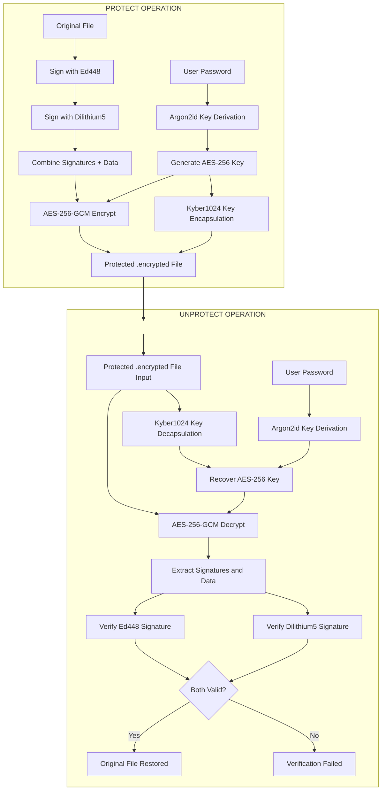

## How it works

```mermaid
flowchart TD
    subgraph PROTECT["PROTECT OPERATION"]
        A[Original File] --> B[Sign with Ed448]
        B --> C[Sign with Dilithium5]
        C --> D[Combine Signatures + Data]
        
        E[User Password] --> F[Argon2id Key Derivation]
        F --> G[Generate AES-256 Key]
        
        D --> H[AES-256-GCM Encrypt]
        G --> H
        G --> I[Kyber1024 Key Encapsulation]
        
        H --> J[Protected .encrypted File]
        I --> J
    end
    
    J --> K[" "]
    
    subgraph UNPROTECT["UNPROTECT OPERATION"]
        K --> L[Protected .encrypted File Input]
        L --> M[Kyber1024 Key Decapsulation]
        
        N[User Password] --> O[Argon2id Key Derivation]
        
        M --> P[Recover AES-256 Key]
        O --> P
        
        L --> Q[AES-256-GCM Decrypt]
        P --> Q
        
        Q --> R[Extract Signatures and Data]
        R --> S[Verify Ed448 Signature]
        R --> T[Verify Dilithium5 Signature]
        
        S --> U{Both Valid?}
        T --> U
        U -->|Yes| V[Original File Restored]
        U -->|No| W[Verification Failed]
    end
    
    style K fill:transparent,stroke:transparent
```
